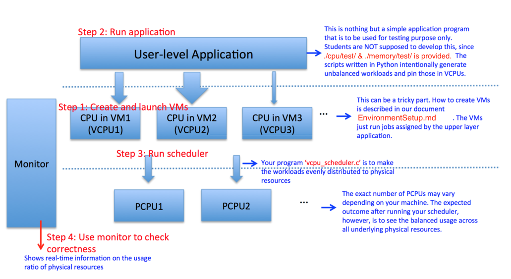

# Project 1 : VM CPU scheduler and Memory Coordinator
---
Please read through the entire page, before getting started. You may create a **PRIVATE** github repository on [GT github](https://github.gatech.edu) to render this README.md.


## Project Overview
In this project, you are going to implement a vCPU scheduler and a memory coordinator to dynamically manage the resources assigned to each guest machine. Each of these programs will be running in the host machine's user space, collecting statistics for each guest machine through hypervisor calls and taking proper actions. 

During one interval, the vCPU scheduler should track each guest machine's vCpu utilization, and decide how to pin them to pCpus, so that all pCpus are "balanced", where every pCpu handles similar amount of workload. The "pin changes" can incur overhead, but the vCPU scheduler should try its best to minimize it. 

Similarly, during one interval, the memory coordinator should track each guest machine's memory utilization, and decide how much extra free memory should be given to each guest machine. The memory coordinator should set the memory size of each guest machine and trigger the balloon driver to inflate and deflate. The memory coordinator should react properly when the memory resource is insufficient. 

Tools that you will need:

- `qemu-kvm, libvirt-bin, libvirt-dev` are packages you need to install so that you can launch virtual machines with KVM and develop programs to manage virtual machines.
- [`libvirt`](https://libvirt.org/) is a toolkit providing lots of APIs to interact with the virtualization capabilities of Linux.
- [Virtualization](https://ubuntu.com/server/docs/virtualization-introduction) is a page you should check.
- `virsh, uvtool, virt-top, virt-clone, virt-manager, virt-install` are tools that may help you play with virtual machines.
- `script` command to make a typescript of your terminal session and generate a log file.


## Environment Setup
1. You have two main options for setting up your development environment:
   - **Cloud VM on Azure**: Ideal for both development and testing.
   - **Preconfigured Local Environment**: Use the provided setup with Vagrant and VirtualBox.

2. If you're on **Windows (Hyper-V enabled)** or **macOS**, it's recommended to go with the Azure cloud VM.

3. Refer to [EnvironmentSetup.md](./EnvironmentSetup.md) (section: *Setting Up Your Environment*) for step-by-step instructions on:
   - Configuring an Azure cloud VM.
   - Setting up your environment with [Vagrant](https://www.vagrantup.com/downloads) and [VirtualBox](https://www.virtualbox.org/wiki/Downloads).

4. If you choose Vagrant or a local setup, ensure your system meets these requirements:
   - At least 6 GB of RAM.
   - 4 physical CPU cores.
   - Default SSH login for the Vagrant VM:
     - **Username**: `vagrant`
     - **Password**: `vagrant`

5. The [EnvironmentSetup.md](./EnvironmentSetup.md) file also provides instructions for creating VMs on a KVM hypervisor (section: *Creating Test VMs*).

⚠️ **Important**: If you decide to configure your environment manually, make sure:
   - Your machine or VM settings match those specified in the `Vagrantfile`.
   - All required packages are installed.


## Where can I find the APIs I might need to use?
1. [`libvirt-domain`](https://libvirt.org/html/libvirt-libvirt-domain.html) provides APIs to monitor and manage the guest virtual machines.
2. [`libvirt-host`](https://libvirt.org/html/libvirt-libvirt-host.html) provides APIs to query the information regarding host machine.


## Directory layout
- This directory contains a boilerplate code, testing framework, and example applications for evaluating the functionality of your CPU Scheduler and Memory Coordinator. 
- The boiler plate code is provided in */cpu/src/* and */memory/src/* folders.
- Details for testing the CPU Scheduler can be found in *cpu/test/* folder and details for testing the Memory Coordinator can be found in the *memory/test/* folder.


## Project Flow
Refer to the flowchart below to help understand the overall project concept. We are taking the CPU scheduler as an example here.




## VCPU Scheduler

### **Tasks**
1. Complete the function CPUScheduler() in `vcpu_scheduler.c`.
2. If you are adding extra files, make sure to modify the `Makefile` accordingly.
3. Compile the code using the command `make all`.
4. You can run the code by `./vcpu_scheduler <interval>`. For example, `./vcpu_scheduler 2` will run the scheduler with an interval of 2 seconds.
5. While submitting, write your algorithm and logic in the readme [`cpu/src/Readme.md`](./cpu/src/Readme.md).


### **Step-by-Step Guide**
1. **Connect to the Hypervisor**:
   - Use the `virConnect*` functions in `libvirt-host` to establish a connection.
   - For this project, connect to the local hypervisor at `qemu:///system`.

2. **List Active Virtual Machines**:
   - Retrieve all actively running virtual machines within `qemu:///system` using the `virConnectList*` functions.

3. **Collect VCPU Statistics**:
   - Use the `virDomainGet*` functions from `libvirt-domain` to gather VCPU statistics.
   - If host PCPU (physical CPU) information is also required, use the relevant APIs in `libvirt-host`.

4. **Handle VCPU Time Data**:
   - VCPU time is typically provided in nanoseconds, not as a percentage.
   - Transform this data into a usable format or incorporate it directly into your calculations.

5. **Determine VCPU to PCPU Mapping**:
   - Use the `virDomainGet*` functions to identify the current mapping (affinity) between VCPUs and PCPUs.

6. **Develop Your Algorithm**:
   - Based on the collected statistics, design an algorithm to find the "best" PCPU for each VCPU.
   - Optimize for efficient CPU usage while ensuring no PCPU is over- or under-utilized.

7. **Update VCPU-Pinning**:
   - Use the `virDomainPinVcpu` function to dynamically assign each VCPU to its optimal PCPU.

8. **Create a Periodic Scheduler**:
   - Start with a "one-time scheduler" to establish a baseline.
   - Revise it to run periodically for ongoing optimization.

9. **Test Your Scheduler**:
   - Launch several virtual machines and simulate workloads to consume CPU resources.
   - Evaluate the scheduler’s performance by observing how well it balances and stabilizes CPU usage across PCPUs.


### **Key Considerations**

**Algorithm Requirements**
- The algorithm must be **independent of the number of VCPUs and PCPUs**. 
- It should handle all configurations, including:
  - **#VCPUs > #PCPUs**: More virtual CPUs than physical CPUs.
  - **#VCPUs = #PCPUs**: Equal number of virtual and physical CPUs.
  - **#VCPUs < #PCPUs**: Fewer virtual CPUs than physical CPUs.
- A generic approach that focuses on stabilizing processor usage is sufficient and will naturally handle these cases without requiring specific logic for each scenario.
- The expectation of the tescases provided operate under the assumption of 8 vcpus and 4 pcpus. But they can be extended to a different count of pcpus. For example, for an 8 core system (8 pcpus), you should be able to evaulate your algorithm for a setup of 16 VMs (16 vcpus) with similar expectation.

---

**What Constitutes a Balanced Schedule?**
- A **balanced schedule** ensures that no PCPU is underutilized or overutilized.
- The **standard deviation of CPU utilizations** is a suitable metric for assessing balance:
  - For a balanced schedule, the absolute value of the standard deviation should be **≤ 5**.

---

**What Constitutes a Stable Schedule?**
- A **stable schedule** minimizes unnecessary changes to VCPU-PCPU assignments once a balanced schedule is achieved.
- Frequent reassignments should be avoided unless required to maintain balance.

 

## Memory Coordinator

### **Tasks**
1. Complete the function MemoryScheduler() in `memory_coordinator.c`.
2. If you are adding extra files, make sure to modify Makefile accordingly.
3. Compile the code using the command `make all`.
4. You can run the code by `./memory_coordinator <interval>`. For example, `./memory_coordinator 2` will run the coordinator with an interval of 2 seconds.
5. While submitting, write your algorithm and logic in the readme [`memory/src/Readme.md`](./memory/src/Readme.md).

### **Step-by-Step Guide**
1. **Connect to the Hypervisor**: 
   - Use the `virConnect*` functions in `libvirt-host` to establish a connection.
   - For this project, connect to the local hypervisor at `qemu:///system`.

2. **List Active Virtual Machines**:
   - Retrieve all active virtual machines within `qemu:///system` using the `virConnectList*` functions.

3. **Enable Memory Statistics Collection**:
   - Use the `virDomainSetMemoryStatsPeriod` function to configure memory statistics collection.

4. **Retrieve Memory Statistics**:
   - Decide which memory statistics are relevant for your use case.
   - Use the `virDomainGet*` and `virDomainMemory*` functions to fetch the required data.

5. **Fetch Host Memory Information**:
   - Use the `virNodeGet*` functions in `libvirt-host` to gather host memory details.

6. **Design Your Algorithm**:
   - Develop a policy to allocate extra free memory to each virtual machine based on the collected statistics.
   - Decide how much memory should be reserved and how much can be dynamically allocated.

7. **Update Memory Allocation**:
   - Use the `virDomainSetMemory` function to dynamically adjust the memory for each virtual machine. This triggers the balloon driver.

8. **Create a Periodic Memory Scheduler**:
   - Start with a "one-time scheduler" and revise it to run periodically for continuous optimization.

9. **Test the Memory Coordinator**:
   - Launch several virtual machines and simulate memory usage by running test workloads.
   - Gradually consume memory resources and evaluate the performance of your memory scheduler.

---

### Key Considerations

**Algorithm Requirements**
1. Ensure that both the VMs and the host retain sufficient memory after releasing any memory.
2. Release memory gradually:
   - For example, if a VM has 300 MB of memory, do not release 200 MB in a single step.
3. Maintain a minimum of 100 MB of unused memory for each VM.
4. The host should not release memory if it has less than or equal to 200 MB of unused memory.


## Recording Test Results with `script`

To validate your scheduler or coordinator, use the `script` command to record terminal sessions and store the results in a log file. This process ensures a detailed record of test outcomes. Follow these steps:

### **Steps to Record Test Results**
1. **Start Recording**:
   - Run the `script` command to start recording terminal output:
     ```bash
     script vcpu_scheduler1.log
     ```
     or
     ```bash
     script memory_coordinator1.log
     ```

2. **Run the Monitor**:
   - Execute the monitor test using the `monitor.py` script:
     ```bash
     python3 monitor.py -t runtest1.py
     ```
     Replace `runtest1.py` with the appropriate test case. Run **3 test cases each for CPU and memory**.

3. **Run Your Scheduler or Coordinator**:
   - Launch your program on a separate terminal to perform scheduling or memory coordination.

4. **Stop Recording**:
   - Exit the `script` command by typing:
     ```bash
     exit
     ```
   - Verify that the log file has been generated and contains the expected results.

5. **Repeat for All Test Cases**:
   - Ensure you generate separate log files for each test case.
   - For accurate results, reboot your VMs before running each test.

---

**Additional Information**
- The log file will be saved in the current working directory upon exiting the `script` command.
- For more details about `script`, refer to its manual by running:
  ```bash
  man script
  ```


## Testing Process

1. **Testing the CPU Scheduler**:
   - Follow the instructions provided in [./cpu/test/HowToDoTest.md](./cpu/test/HowToDoTest.md).
   - There are 3 test cases for the CPU scheduler. Detailed scenarios and expected outcomes for each test case are available in [./cpu/test/HowToDoTest.md](./cpu/test/HowToDoTest.md).

2. **Testing the Memory Coordinator**:
   - Follow the instructions provided in [./memory/test/HowToDoTest.md](./memory/test/HowToDoTest.md).
   - There are 3 test cases for the memory coordinator. Detailed scenarios and expected outcomes for each test case are available in [./memory/test/HowToDoTest.md](./memory/test/HowToDoTest.md).

> **Note**: In the autograder environment:
> - Up to 4 VMs will be used for memory coordinator tests.
> - Up to 8 VMs will be used for VCPU scheduler tests.
> - Each VM will be configured with 1 VCPU.


## Grading
This is not a performance-oriented project, we will test the _functionality only_. Please refer to the [sample output pdf](./res/sample-sol-1.pdf) to understand the expected behavior from the scheduler and coordinator across test cases on the autograder. More details can be found in the test directories described in the [testing section](#testing-process).

The Rubric will be: 
1. vCPU scheduler functionality - 6 points
    - The scheduler should aim to make the pCPUs enter a stable and a balanced state.
    - 1 point for Readme.
    - 1 points for first 3 test cases whose implementation is available.
    - 4 for the remaining 4 test cases.

2. Memory coordinator functionality - 6 points
    - The VMs should consume or release memory appropriately for each test case.
    - Don't kill the guest operating system (Do not take all the memory resource from guests).
    - Don't freeze the host (Do not give all available memory resources to guests).
    - 5 points for implementation (1.25 per test case) and 1 point for Readme.


## Deliverables & Submission
You need to implement two separate C programs, one for vCPU scheduler (`/cpu/src/vcpu_scheduler.c`) and another for memory coordinator(`/memory/src/memory_coordinator.c`). Both programs should accept one input parameter, the time interval (in seconds) your scheduler or coordinator will trigger. For example, if we want the vCPU scheduler to take action every 2 seconds, we will start your program by doing `./vcpu_scheduler 2`. Note that the boiler plate code is provided in the attached zip file. 

You need to submit one zipped file named `FirstName_LastName_p1.zip` (e.g. `George_Burdell_p1.zip`) containing a subfolder named `FirstName_LastName_p1` and two separate subfolders(cpu and memory) within the `FirstName_LastName_p1` subfolder, each containing a `Makefile`, `Readme.md` (containing code description and algorithm), source code and the log files generated through `script` command for each test case. Use the script `collect_submission.py` to generate the zip file. 

We will compile your program by just doing `make`. Therefore, your final submission should be structured as follows after being unzipped. Don’t change the name of the files. Please adhere to the submission instructions, not doing so will result in a penalty of points. 

```
- FirstName_LastName_p1/
      - cpu/
            - vcpu_scheduler.c
            - Makefile
            - Readme.md (Code Description and algorithm) 
            - 3 vcpu_scheduler.log files — vcpu_scheduler1.log and so on for each test case 
      - memory/
            -  memory_coordinator.c
            -  Makefile 
            -  Readme.md (Code Description and algorithm) 
            -  3 memory_coordinator.log files — memory_coordinator1.log and so on for each test case
```

To generate the final zip file, ensure that all the required files are present and run the following command:

```
python3 collect_submission.py 
```

Once you've successfully created a zip folder as per instructions, you must upload that zip folder on Gradescope. Keep in mind that *each submission will take around 40 minutes* to autograde during off-peak hours, so be advised to submit early!

In the interest of being fair to all students, please refrain from using the gradescope environment as your developing environment as this will affect your fellow students' ability to submit. To this end, there is a modest limit of *20 submissions per user* (enforced manually by the teaching team after the deadline).
