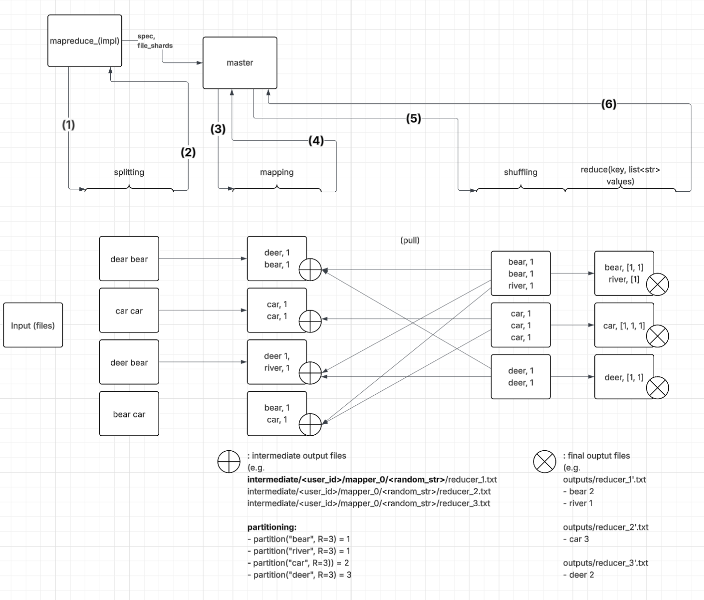

# cs6210Project4 - MapReduce
Members: Seungjae Lee, Taehyeok Jang

## 1. MapReduce Implementation

This project implements a simplified MapReduce framework using C++ and gRPC. The system consists of a **master** node that manages the workflow and multiple **worker** nodes that perform **map** and **reduce** tasks in parallel. The communication between nodes is handled via **gRPC**, and the input data is split into shards to facilitate distributed processing.

### Workflow Overview:
1. The **master** reads a config file and initializes the system based on provided specs (e.g., file paths, shard sizes, number of mappers/reducers).
2. Input files are split into **shards**, and each shard is assigned to a worker for processing.
3. Workers perform **map** tasks using a user-provided mapper function and generate intermediate files.
4. After all map tasks complete, the master assigns **reduce** tasks to workers, where they aggregate and process the intermediate files.
5. Final outputs are written to the specified output directory.

## 2. `masterworker.proto`

This file defines the gRPC protocol used for communication between the master and worker nodes. It includes service definitions and message formats for:

- **Map task assignment**: Master sends file shards and parameters to a worker.
- **Reduce task assignment**: Master sends intermediate file locations to a worker.
- **Task completion acknowledgment**: Workers respond with success status, output file paths, and error info (if any).

We support **synchronous communication** to ensure each worker fully completes its assigned task before being given a new one. This enables **parallel task execution** across multiple workers while keeping task tracking simple and deterministic on the master side.

## 3. `file_shard.h`

This file defines the structure and logic for splitting large input files into manageable **shards** for mappers to process in parallel. The `FileShard` and `FilePiece` structures encapsulate information about individual file chunks and their byte offsets. The list below covers key features implemented in the file:
- Splits input files into shards based on a target kilobyte size.
- Ensures that shards align with line boundaries to preserve record integrity.
- Each shard may consist of multiple `FilePiece`s (ranges within a file).
- The resulting list of shards is passed to workers via gRPC in `master.h`.

This design enables balanced workload distribution across workers while maintaining correctness of line-based input data.

## 4. `map_reduce_spec.h`

This file defines the configuration structure for running a MapReduce job. It reads the settings from a config file and populates the `MapReduceSpec` struct with parameters like:

- Number of workers
- Worker addresses
- Input files
- Output directory
- Output file count
- Map task size
- User ID

It includes:
- `read_mr_spec_from_config_file(...)`: Parses the config file and fills in the spec.
- `validate_mr_spec(...)`: Performs basic sanity checks to ensure the configuration is valid.

This struct is used across the master to initialize and coordinate the MapReduce job.

## 5. `master.h`

This file implements **Master** that drives both map and reduce phases with built‑in fault‑tolerance (speculative execution, failure handling):

- **Worker pool & stubs**  
  One gRPC stub per worker; tracks each worker’s state (`IDLE` / `BUSY` / `DEAD`).

- **`run()` entry point**  
  1. `init_workers_()` – build channels to all workers  
  2. `run_phase(MAP, num_shards)` – dispatch all map tasks  
  3. `run_phase(REDUCE, n_output_files)` – dispatch all reduce tasks  
  4. `cleanup_intermediate_()` – remove temporary dirs

- **`run_phase()` scheduler with fault-tolerance**  
  - **Worker threads** wait on a shared queue of task IDs, claim work, call `do_map()` or `do_reduce()`, then update shared state.  
  - **Failure handling**: RPC or logic failure marks the worker `DEAD` and re‑queues its task until it succeeds.  
  - **Speculative execution**: A monitor thread wakes every 500 ms, computes the fastest task so far, and re‑queues any running task whose duration exceeds `max(4 seconds, 2.5×min_elapsed)`—logging each “straggler detected” event.

- **`doMapTask()` / `doReduceTask()` RPC wrappers**  
  - `doMapTask()` creates a unique `./intermediate/<user>/<mapper>/<randID>` directory, issues `assignMapTask`, and records the path on success.  
  - `doReduceTask()` gathers all intermediate dirs, issues `assignReduceTask`, and retries on failure.

## 6. `mr_tasks.h`

This file contains the core implementation of **BaseMapper** and **BaseReducer**, which are responsible for handling the mapping and reducing operations in the MapReduce framework.

### **BaseMapper**

The **BaseMapper** class is responsible for:
1. **Initializing the Mapper**: It stores metadata such as the mapper ID, the number of output files, and the directory for intermediate files.
2. **Emitting Key-Value Pairs**: The `emit` function allows the mapper to output key-value pairs, which are distributed to the appropriate reducers based on a hash function. If the number of buffered items exceeds a threshold, the data is saved to intermediate files.
3. **Saving Data to Intermediate Files**: The `save_as_files` function writes the buffered data to files for each reducer. This operation is performed periodically to avoid excessive memory usage.

### **BaseReducer**

The **BaseReducer** class handles the **reduce** phase:
1. **Initializing the Reducer**: Similar to the mapper, the reducer stores its ID and the output directory.
2. **Emitting Key-Value Pairs**: The `emit` function stores key-value pairs in a map. If the number of emitted items exceeds a threshold, the data is saved to the output file.
3. **Saving Data to Output Files**: The `save_as_file` function writes the aggregated key-value pairs to an output file. Each reducer writes to a separate file, ensuring the results of each reducer are stored independently.

## 7. `worker.h`

This file contains the worker-side implementation of the MapReduce framework. A worker exposes gRPC services to handle map and reduce tasks sent by the master and uses dynamically loaded user-defined functions to execute the actual logic.

### Map Task:
- Initializes the mapper via a task factory.
- Processes file pieces based on byte offsets.
- Calls the `map` function for each line of input.
- Writes partitioned intermediate files for reducers.

### Reduce Task:
- Reads relevant intermediate files based on reducer ID.
- Groups values by key and invokes the `reduce` function.
- Outputs the final results to the designated output directory.
